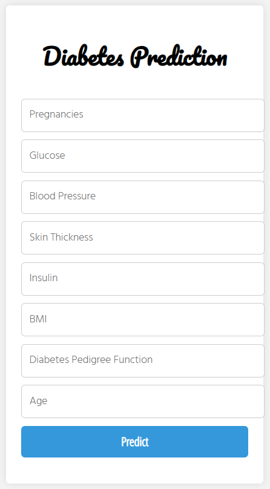

## Diabetes-prediction-with-deployment

End-to-end deployment for diabetes prediction refers to the entire process of creating a diabetes prediction model and making it available to end users in a production setting. Data gathering, preprocessing, model construction, evaluation, deployment, user interface development, integration, testing, and continuous maintenance are all included in this process.

To start, pertinent information is gathered, including details on births, blood sugar levels, blood pressure, skin thickness, insulin, BMI, function of diabetes in families, and age. After managing missing values and outliers, the data is preprocessed by conducting feature scaling or normalisation.

Next, the model is trained using the preprocessed data and an appropriate machine learning technique. On a different testing dataset, the model's performance is assessed. To improve the model's accuracy, optimisation approaches like hyperparameter tuning and algorithm selection are used.

## Front end Deployment 
